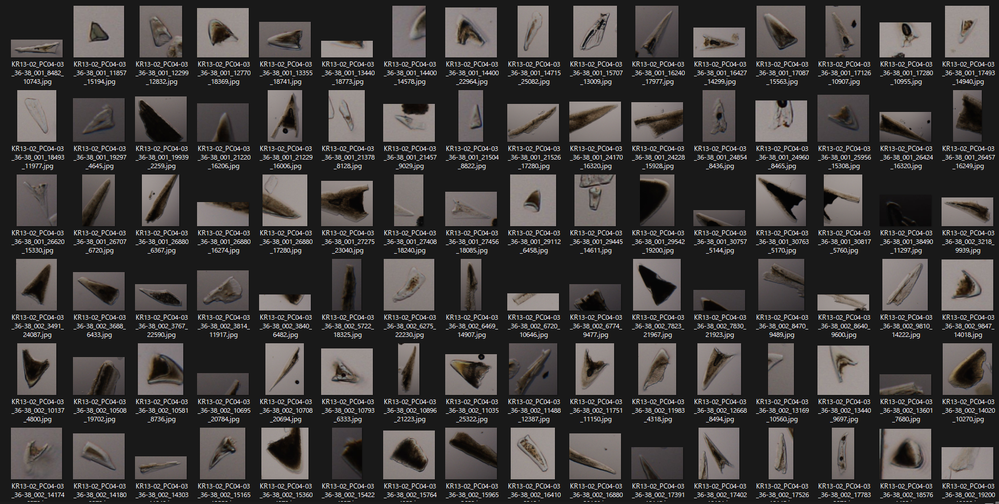

# yolov7-slideObservation
<p align="center">
   
</p>


## Note
- This repository contains source codes for the following paper. If you find this repository useful, please consider citing the following paper.
  
   Mimura, K.,Nakamura, K., Yasukawa, K., Sibert, E. C., Ohta, J., Kitazawa, T. and Kato, Y. :Applicability of Object Detection to Microfossil Research: Implications From Deep Learning Models to Detect Microfossil Fish Teeth and Denticles Using YOLO-v7. <i>Earth and Space Science</i>, <b>11(1)</b>, e2023EA003122, https://doi.org/10.1029/2023EA003122, 2024.
   
- Most of the program files in this repository are cloned from [WongKinYiu/yolov7](https://github.com/WongKinYiu/yolov7).

## What is new?
This repository is designed for the observation of glass slides using a microscope. The originality is the following.

1. We enabled detection from multiple folders without re-loading of detection model by `continuous_detect.py`.
2. When wide slide is divided into multiple images, some objects may appear in multiple (2-4) images, which leads to duplication in detection results. To reduce duplication, the function `generate_csv` writen in [`utils/custom_functions.py`](/utils/custom_functions.py) checks duplication by calculating "Absolute coordinates." [More detail: KazuhideMimura/ai_ichthyolith](https://github.com/KazuhideMimura/ai_ichthyolith/).

## How to use?
### Training, validating and testing yolov7 models
Please follow explanations at [WongKinYiu/yolov7](https://github.com/WongKinYiu/yolov7).

### hierarchy for managing images
- Site: location of the core drilled. Any site name can be used as long as it does not contain special symbols and spaces. (e.g. `Site_1149`) 
- Sample: Corresponding to sampling horizon. Any sample name can be used as long as it does not contain special symbols and spaces. (e.g. `1149B_03_01_100`)
- Slide: Corresponding to one glass slide. Name of slide should be `sample name` + slide number (001, 002, ...), such as `1149B_03_01_100_001`.
- Image: Corresponding to one image file taken from glass slide. Name of image file should be `slide name` + (Y and X coordinates concatenated by underbar) + file extention, such as `1149B_03_01_100_001_960_14400.jpg`.

###  Directory for detection images
```
<site_name>
  └ <sample_name>
  　　├ <sample_name_001>
  　　│ 　├ <sample_name_001_Y1_X1.jpg>
  　　│ 　├ <sample_name_001_Y1_X2.jpg>
  　　│ 　│　 ...
  　　│ 　
  　　├ <sample_name_002>

      ...
```
See folder [slide_images](/slide_images) for an example of detection image files.


### Detection
**single folder for trial**

`python detect.py --conf 0.288 --source inference/ichthyolith --img-size 640 --weights runs/train/v7x_20221226_3cls_02all_640/weights/best.pt`

**detecting images taken at one site continuously**

`python continuous_detect.py --conf 0.288 --source slide_images/Site_1149 --img-size 640 --weights runs/train/v7x_20221226_3cls_02all_640/weights/best.pt --name v7x_20221226_3cls_02all_640 --nosave --save-txt --save-conf`

### Detection example
class **Tooth**:

<p align="center">
   
</p>

class **Denticle**:

<p align="center">
   
</p>

class **Saw-toothed**:

<p align="center">
   
</p>


## Dataset
Datasets for this project are available on [Figshare](https://dx.doi.org/10.6084/m9.figshare.22736609).

## Trained weights
Trained weights are temporally shared on [Google Drive](https://drive.google.com/drive/folders/1oDLuxzNEAwJGiK4iP5mRY8a0TFYyc8hM?usp=share_link).

## Log
2023.5.3 Version 1

2023.5.2 Opened repository

2023.5.25 Preprint is shared at [ESS Open Archive](https://doi.org/10.22541/essoar.168500340.03413762/v1),